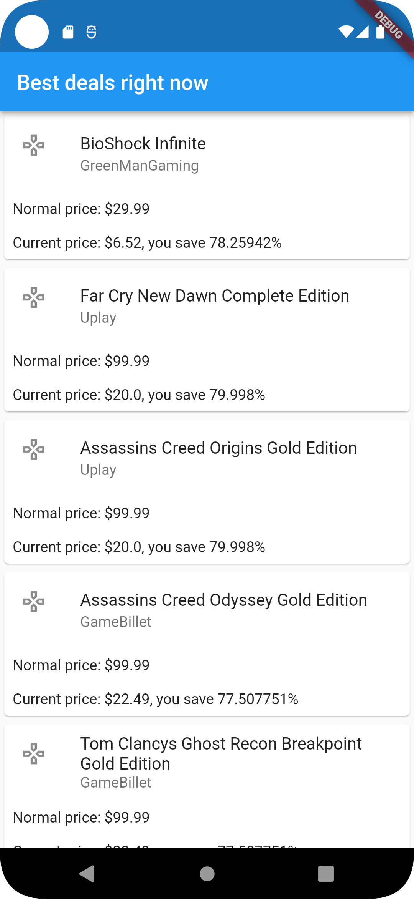
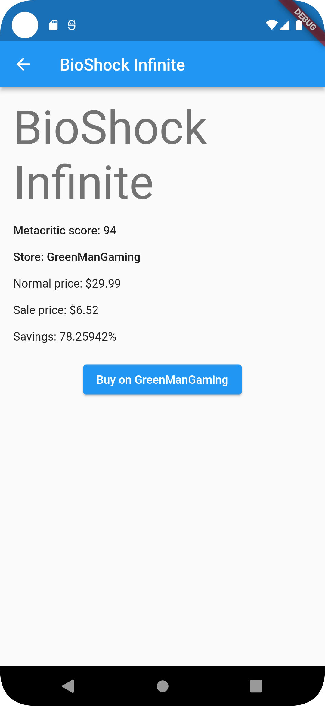
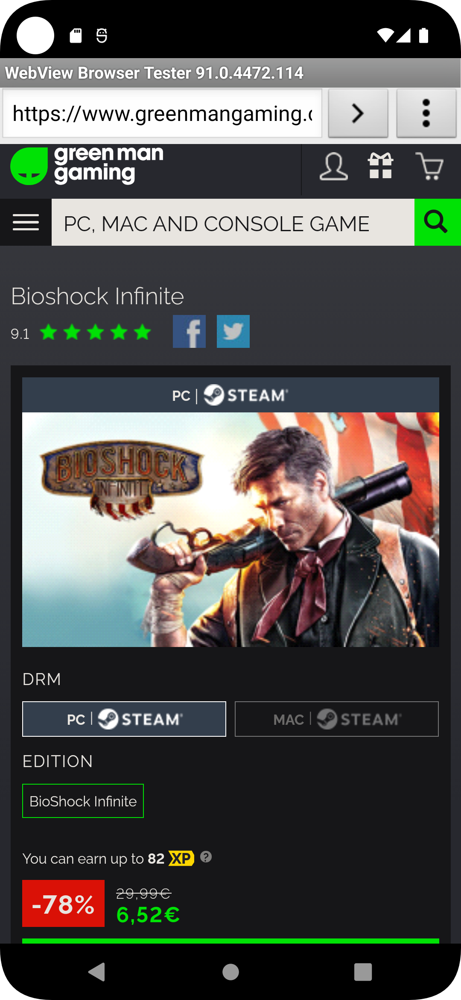

# Games deals tracker demo Flutter app

Home | Details | Store (web browser)
:---:|:-------:|:-------------------:
 |  | 

This is a demo application implementing a simple video game deal tracker written in Flutter.

The data about game deals is obtained from https://www.cheapshark.com/ API.

The app architecture follows Clean Architecture and BLOC. Sources:

 - https://devmuaz.medium.com/flutter-clean-architecture-series-part-1-d2d4c2e75c47
 - https://bloclibrary.dev/#/gettingstarted
